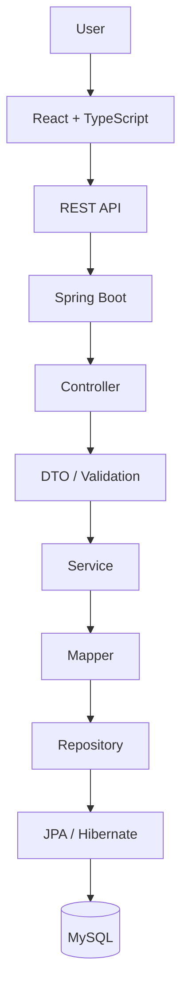
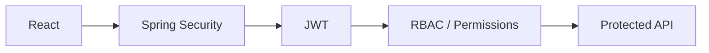

<div align="center">

# Spidosoft ERP

**Enterprise Resource Planning platform for structured business operations and master-data management.**

[](#project-status)
[](#technology-stack)
[](#technology-stack)
[](#license)

[Live Demo](https://spidosoft-erp-ch48.vercel.app/) · [Repository](https://github.com/AtharvaVavhal/spidosoft-erp)

</div>

<br/>

Spidosoft ERP is an industrial ERP initiative built for **Spidosoft Technologies OPC Pvt. Ltd.**, developed by a Computer Engineering (Software Engineering) student team at **Vishwakarma Institute of Technology, Pune**. The system is designed as a modular monolith, starting with centralized master-data management and extending toward broader operational workflows as modules are added.

<br/>

## At a Glance

|  |  |
|---|---|
| **Industry Partner** | Spidosoft Technologies OPC Pvt. Ltd. |
| **Institution** | VIT Pune — Dept. of Computer Engineering |
| **Architecture** | Modular Monolith *(target)* |
| **Frontend** | React + TypeScript + Vite |
| **Backend** | Java + Spring Boot *(planned)* |
| **Database** | MySQL *(planned)* |
| **Security** | Spring Security + JWT *(planned)* |
| **API Style** | REST / JSON *(planned)* |

<br/>

## Scope

To keep intent unambiguous, this README separates what's **established requirement**, what's **being built now**, what's **architecturally decided but not yet built**, and what's **still open**.

| Category | Meaning |
|---|---|
| ✅ **Confirmed Scope** | Established by the Spidosoft reference document |
| 🔨 **Current Development** | Actively being specified/built by the team, not sourced from the reference document |
| 🧭 **Planned Architecture** | Technical decisions made for the target system, not yet implemented |
| ❓ **TBD** | Requires company or faculty confirmation |

<br/>

## Core Capabilities

**✅ Item Master** — Item Code, Name, Material, Type/SubType, Color, UOM, HSN/SAC Code, GST Rate, Purchase Cost, Selling Price, Drawing No., Specification.

**✅ Customer Master** — Customer Code, Name, Contact Person, Address, City, State, Country, PIN Code, Email, Telephone, Mobile, GSTIN, Website.

**✅ Supplier Master** — Corresponding supplier business and contact fields.

**✅ Item Mapping** — Link items to customers/suppliers: `Item → Select Customer/Supplier → Add → GridView`.

**🔨 Maintenance / Work Orders** — Part of current development scope. Its detailed fields and workflow are under active specification by the team and are **not** derived from the original company reference document.

> None of the above are implemented in code yet — see [Project Status](#project-status).

<br/>

## Module Map

```
ERP
├── Item Master              ✅ confirmed scope
├── Customer Master          ✅ confirmed scope
├── Supplier Master          ✅ confirmed scope
├── Item Mapping             ✅ confirmed scope
│   ├── Item ↔ Customer
│   └── Item ↔ Supplier
└── Maintenance               🔨 current development
    └── Work Orders
```

<br/>

## Architecture

*Target architecture — the backend does not yet exist in this repository.*



**Security flow** *(target)*



The system is designed as a **modular monolith** — a single deployable backend organized into independent modules — not a microservices architecture. No message queues, caches, or container orchestration are part of the current design.

<br/>

## Technology Stack

### Frontend

| Implemented | Planned |
|---|---|
| React 19, TypeScript, Vite, CSS Modules, CSS Variables, oxlint | React Router, TanStack Query, Axios, React Hook Form, Zod, Lucide React |

### Backend *(planned — not yet in the repository)*
Java 21 · Spring Boot · Maven · Spring Data JPA · Hibernate · MapStruct · Jakarta Bean Validation · Spring Security · JWT · RBAC

### Database *(planned)*
MySQL · Flyway

### Testing *(planned)*
JUnit 5 · Mockito · Spring Boot Test · MockMvc · Vitest · React Testing Library · Playwright

### Engineering
Git · GitHub · GitHub Actions *(no workflows configured yet)* · OpenAPI / Swagger *(planned)*

<br/>

## Repository Structure

```
spidosoft-erp/
└── frontend/
    ├── src/
    │   ├── components/       # MaintenancePage (landing/status screen)
    │   ├── styles/           # tokens.css — design tokens
    │   ├── App.tsx
    │   └── main.tsx
    ├── public/
    ├── svg/                  # Brand assets
    ├── package.json
    └── vite.config.ts
```

No `backend/`, `docs/`, root `.gitignore`, or `LICENSE` exists yet. The frontend currently renders a single placeholder "under construction" screen — there is no ERP application UI, routing, or module implementation at this time.

<br/>

## Quick Start

**Prerequisites:** Git, Node.js (current LTS), npm

```bash
git clone https://github.com/AtharvaVavhal/spidosoft-erp.git
cd spidosoft-erp/frontend
npm install
```

| Command | Purpose |
|---|---|
| `npm run dev` | Start the development server |
| `npm run typecheck` | Type-check the project |
| `npm run lint` | Lint with oxlint |
| `npm run build` | Production build |
| `npm run preview` | Preview the production build |

Backend setup will be documented when the Spring Boot module is introduced.

<br/>

## Environment Configuration

No environment variables or configuration files currently exist in this repository. This section will be populated once backend configuration is introduced. Secrets are never committed or documented here.

<br/>

## Development Workflow

```
main
  ↑
develop
  ↑
feature/*
```

1. Branch from `develop`
2. Build the feature
3. Validate — type-check, lint, test
4. Push the branch
5. Open a pull request into `develop`
6. Review
7. Merge — `develop` promotes to `main` on release

Direct pushes to `main` are discouraged.

<br/>

## Team

| Member | Focus |
|---|---|
| Atharva Vavhal | Team Lead · Architecture · Backend · Integration |
| Vedika Mehta | Frontend · UI · Design System |
| Swapnil Pawar | Backend · Database · Persistence |
| Janhavi Waychal | Frontend · QA · Documentation |

*These reflect development responsibilities within the project team, not ERP system authorization roles.*

<br/>

## Project Status

🟢 Foundation — repository, frontend scaffold, live deployment
🟡 ERP Modules — Item / Customer / Supplier Master, Mapping
🟡 Backend — Spring Boot service
🟡 Database — MySQL schema, Flyway migrations
🟡 Authentication — JWT, RBAC
🟡 Testing — no test tooling configured yet
⚪ Deployment — production rollout

**Current milestone:** establishing the ERP application shell and backend foundation on top of the existing frontend scaffold.

<br/>

## Roadmap

- [x] Repository initialized
- [x] Frontend foundation (React + TypeScript + Vite)
- [x] Landing page deployed
- [ ] ERP application shell
- [ ] Backend foundation (Spring Boot)
- [ ] MySQL schema
- [ ] Authentication (JWT / RBAC)
- [ ] Item Master
- [ ] Customer Master
- [ ] Supplier Master
- [ ] Item mappings
- [ ] Maintenance / Work Orders
- [ ] Automated testing
- [ ] CI/CD
- [ ] Production deployment

<br/>

## Documentation

No supplementary documentation (architecture notes, requirements, database design, API reference, technical decisions, project synopsis) currently exists in this repository. Links will be added here as these documents are committed.

<br/>

## Security

Spring Security, JWT authentication, RBAC, and server-side input validation are **planned** for the backend and are not yet implemented. No secrets or credentials are stored in this repository. Report security concerns directly to the project maintainers rather than via public issues.

<br/>

## License

**TBD** — a license has not yet been selected for this repository.

<br/>

---

<div align="center">

Built by students of **VIT Pune** for **Spidosoft Technologies OPC Pvt. Ltd.**

</div>
