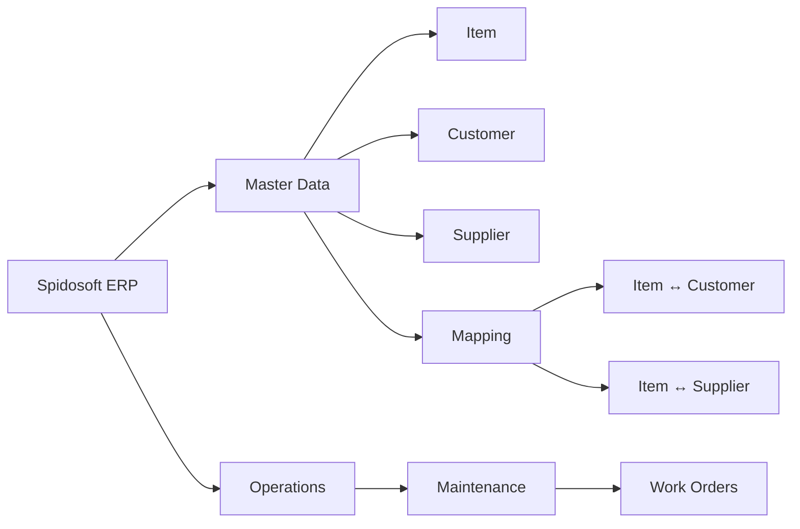
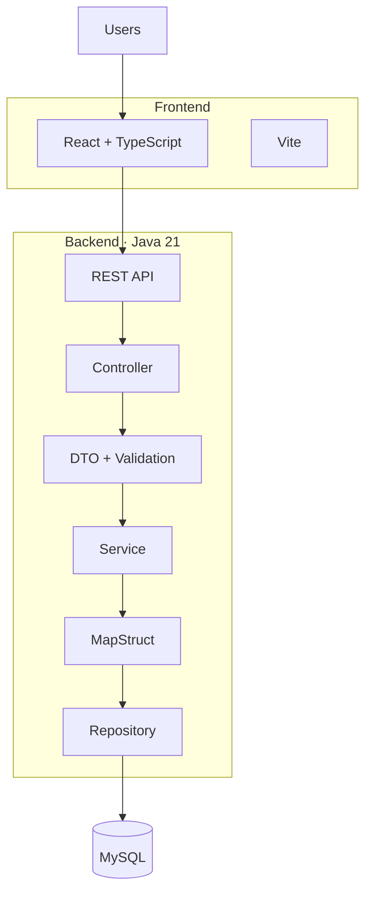
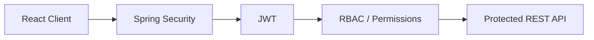

<div align="center">
  

  # Spidosoft ERP

  ### Enterprise Resource Planning for structured business operations.

  A modular ERP platform being engineered for **Spidosoft Technologies OPC Pvt. Ltd.**

  <p>
    <a href="https://spidosoft-erp-ch48.vercel.app/">
      
    </a>
    <a href="https://github.com/AtharvaVavhal/spidosoft-erp">
      
    </a>
  </p>

  
  
  
  
  
  
  

  <sub>Industrial ERP · Modular Architecture · Master Data · REST APIs · Enterprise Workflows</sub>
</div>

<br/>

## Overview

Spidosoft ERP is an industrial ERP system engineered for **Spidosoft Technologies OPC Pvt. Ltd.** by a Computer Engineering team at **Vishwakarma Institute of Technology, Pune**.

The system centers on a single source of truth for the master data that drives daily operations — items, customers, and suppliers — and the structured relationships between them.

It's built as a **modular monolith**: one cohesively organized backend paired with an independently deployable React frontend, communicating over a REST API. This keeps the codebase easy to reason about while leaving room for new operational modules to be added without disturbing the master-data core.

<br/>

## Snapshot

| | |
|---|---|
| **Industry Partner** | Spidosoft Technologies OPC Pvt. Ltd. |
| **Institution** | VIT Pune |
| **Architecture** | Modular Monolith |
| **Frontend** | React + TypeScript |
| **Backend** | Java + Spring Boot |
| **Database** | MySQL |
| **API** | REST / JSON |
| **Security** | Spring Security + JWT |

> The target architecture above is being introduced incrementally as development progresses — see [Status](#status) for what's running today.

<br/>

## Modules

**Master Data**

| Module | Description |
|---|---|
| Item Master | Structured item records — identity, classification, pricing, specification |
| Customer Master | Centralized customer identity and business records |
| Supplier Master | Centralized supplier identity and business records |
| Item Mapping | Item ↔ Customer and Item ↔ Supplier relationships |

**Operations**

| Module | Description |
|---|---|
| Maintenance / Work Orders | Operational maintenance workflows, defined and iterated on by the engineering team |



<br/>

## Architecture

**Target architecture** — the request lifecycle Spidosoft ERP is engineered around.



**Security model**



The system is intentionally a modular monolith — not a microservices architecture — one deployable backend, cleanly separated by module boundaries.

<br/>

## Engineering Principles

- Feature-oriented architecture
- Strong type safety across frontend and backend
- Clear separation of concerns
- API-first design
- Secure boundaries by design
- Reusable, composable UI primitives
- Testable services
- Review-driven Git workflow

<br/>

## Technology Stack

**Frontend**
React · TypeScript · Vite · React Router · TanStack Query · Axios · React Hook Form · Zod · CSS Modules · CSS Variables · Lucide React

**Backend**
Java 21 · Spring Boot · Maven · Spring Data JPA · Hibernate · MapStruct · Jakarta Validation

**Security**
Spring Security · JWT · RBAC / Permissions

**Database**
MySQL · Flyway

**Testing**
JUnit 5 · Mockito · Spring Boot Test · MockMvc · Vitest · React Testing Library · Playwright

**Engineering**
Git · GitHub · GitHub Actions · OpenAPI

> This is the agreed technology baseline for the platform. Entries are adopted as their corresponding modules are implemented — see [Status](#status).

<br/>

## Repository

```
spidosoft-erp/
└── frontend/
    ├── src/
    │   ├── components/
    │   ├── styles/
    │   ├── App.tsx
    │   └── main.tsx
    ├── public/
    ├── svg/
    ├── package.json
    └── vite.config.ts
```

The repository is currently in its frontend foundation stage. The backend, database layer, and ERP modules are being introduced incrementally.

<br/>

## Quick Start

```bash
git clone https://github.com/AtharvaVavhal/spidosoft-erp.git
cd spidosoft-erp/frontend
npm install
npm run dev
```

| Command | Purpose |
|---|---|
| `npm run dev` | Start the development server |
| `npm run typecheck` | Type-check the project |
| `npm run lint` | Lint the codebase |
| `npm run build` | Production build |
| `npm run preview` | Preview the production build |

**Live preview:** [spidosoft-erp-ch48.vercel.app](https://spidosoft-erp-ch48.vercel.app/) — the project's current landing experience, while ERP functionality is under active development.

<br/>

## Workflow

```
feature/*  →  Pull Request  →  Code Review  →  develop  →  main
```

Work happens on feature branches off `develop`, validated and reviewed via pull request before merging. Stable changes are periodically promoted from `develop` to `main`.

<br/>

## Team

| Member | Focus |
|---|---|
| Atharva Vavhal | Team Lead · Architecture · Backend · Integration |
| Vedika Mehta | Frontend · UI · Design System |
| Swapnil Pawar | Backend · Database · Persistence |
| Janhavi Waychal | Frontend · QA · Documentation |

**Project Guide:** Prof. Rahul Pawar — Department of Computer Engineering (Software Engineering), VIT Pune

<br/>

## Status

| Area | Status |
|---|---|
| Repository | 🟢 Active |
| Frontend Foundation | 🟢 Active |
| ERP Application Shell | 🟡 Next |
| Backend | 🟡 Planned |
| Database | 🟡 Planned |
| Authentication | 🟡 Planned |
| Master Data | 🟡 In Development |
| Maintenance | 🟡 In Development |
| Testing | ⚪ Planned |
| Production | ⚪ Future |

<br/>

## Roadmap

- [x] Repository foundation
- [x] React + TypeScript frontend
- [x] Landing experience
- [ ] ERP application shell
- [ ] Spring Boot backend
- [ ] MySQL persistence
- [ ] Authentication & RBAC
- [ ] Item Master
- [ ] Customer Master
- [ ] Supplier Master
- [ ] Item Mapping
- [ ] Maintenance / Work Orders
- [ ] Automated testing
- [ ] CI/CD
- [ ] Production deployment

<br/>

## Documentation

Project documentation is being developed alongside implementation.

<br/>

## Security

Target security architecture: Spring Security, JWT authentication, RBAC-based permissions, server-side validation, and environment-based secrets management — introduced as the backend is implemented. No secrets or credentials are stored in this repository.

<br/>

## License

License — TBD

<br/>

---

<div align="center">

**Spidosoft ERP**

Built at Vishwakarma Institute of Technology, Pune
for Spidosoft Technologies OPC Pvt. Ltd.

</div>
