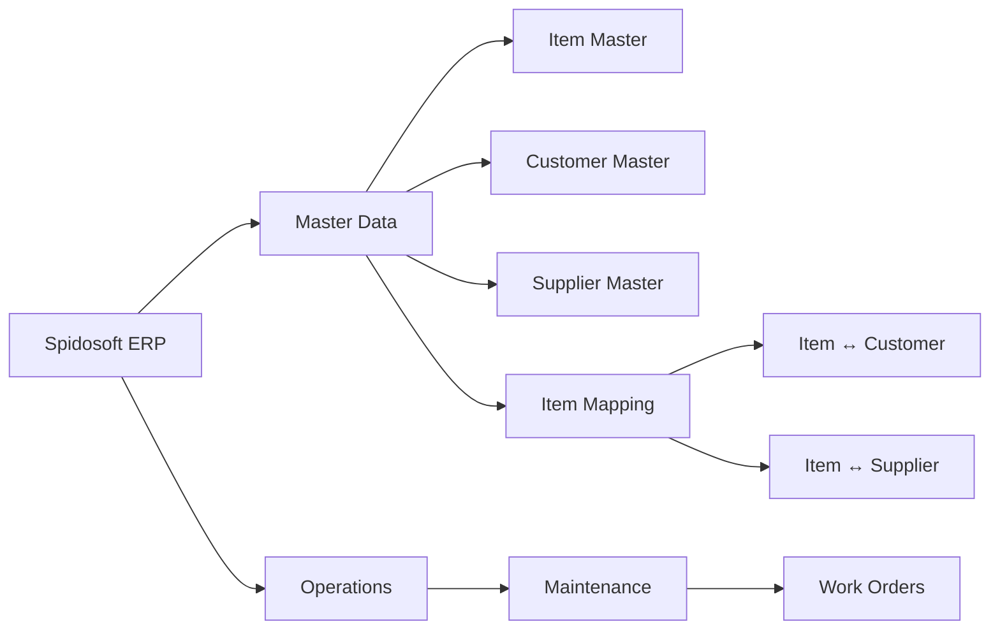
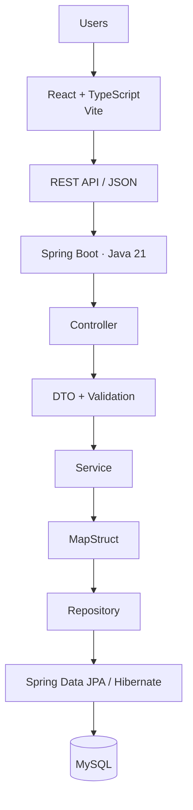

<div align="center">
  

  # Spidosoft ERP

  ### Enterprise Resource Planning for structured business operations.

  A modular ERP platform being engineered for<br/>
  **Spidosoft Technologies OPC Pvt. Ltd.**

  [Live Demo](https://spidosoft-erp-ch48.vercel.app/) · [Repository](https://github.com/AtharvaVavhal/spidosoft-erp)

  
  
  
  
  
  
</div>

<br/>

Spidosoft ERP is an industrial ERP system engineered for **Spidosoft Technologies OPC Pvt. Ltd.** by a Computer Engineering team at **Vishwakarma Institute of Technology, Pune**. It is built around a centralized master-data foundation, a clean frontend/backend separation, and a modular architecture designed to grow with the business.

<br/>

## Contents

[Overview](#overview) · [Modules](#modules) · [Architecture](#architecture) · [Engineering Principles](#engineering-principles) · [Technology Stack](#technology-stack) · [Repository](#repository) · [Quick Start](#quick-start) · [Workflow](#workflow) · [Team](#team) · [Status](#status) · [Roadmap](#roadmap)

<br/>

## Overview

At its core, Spidosoft ERP centralizes the master data that drives day-to-day operations — items, customers, and suppliers — and the structured relationships between them. The system is designed as a **modular monolith**: a single, cohesively organized backend service paired with an independent React frontend, communicating over a REST API.

This structure keeps the codebase easy to reason about while leaving room to grow — new operational modules can be added without disturbing the master-data core.

<br/>

## Modules

**Master Data** — established by the Spidosoft functional reference

| Module | Description |
|---|---|
| **Item Master** | Item code, name, material, type, UOM, HSN/SAC, GST rate, cost, pricing, and specification data |
| **Customer Master** | Customer identity, contact, address, and GSTIN records |
| **Supplier Master** | Supplier identity, contact, and business records |
| **Item Mapping** | Item ↔ Customer and Item ↔ Supplier relationships |

**Operations** — current engineering focus

| Module | Description |
|---|---|
| **Maintenance / Work Orders** | Operational maintenance workflows, defined and iterated on by the engineering team |



<br/>

## Architecture

**Target architecture** — the request lifecycle Spidosoft ERP is engineered around.



**Security model**


The system is intentionally a **modular monolith**, not a microservices architecture — one deployable backend, cleanly separated by module boundaries.

<br/>

## Engineering Principles

- Modular by feature, not by convenience
- Strong type safety across frontend and backend
- Clear separation of concerns — controller, service, repository
- API-first backend design
- Secure by design — validation and access control at the boundary
- Reusable, composable UI primitives
- Testable services and predictable data flow
- Review-driven Git workflow

<br/>

## Technology Stack

**Frontend**
React · TypeScript · Vite · React Router · TanStack Query · Axios · React Hook Form · Zod · CSS Modules · CSS Variables · Lucide React

**Backend**
Java 21 · Spring Boot · Maven · Spring Data JPA · Hibernate · MapStruct · Jakarta Validation · Spring Security · JWT

**Data**
MySQL · Flyway

**Testing**
JUnit 5 · Mockito · Spring Boot Test · MockMvc · Vitest · React Testing Library · Playwright

**Engineering**
Git · GitHub · GitHub Actions · OpenAPI

> Stack entries represent the agreed target architecture and are introduced incrementally as each module is implemented. See [Status](#status) for what's currently running.

<br/>

## Repository

```
spidosoft-erp/
└── frontend/
    ├── src/
    │   ├── components/
    │   ├── styles/
    │   ├── App.tsx
    │   └── main.tsx
    ├── public/
    ├── svg/
    ├── package.json
    └── vite.config.ts
```

The repository is currently in its frontend foundation stage. The Spring Boot backend, database layer, and ERP modules are being introduced incrementally.

<br/>

## Quick Start

```bash
git clone https://github.com/AtharvaVavhal/spidosoft-erp.git
cd spidosoft-erp/frontend
npm install
npm run dev
```

| Command | Purpose |
|---|---|
| `npm run dev` | Start the development server |
| `npm run typecheck` | Type-check the project |
| `npm run lint` | Lint the codebase |
| `npm run build` | Production build |
| `npm run preview` | Preview the production build |

**Live preview:** [spidosoft-erp-ch48.vercel.app](https://spidosoft-erp-ch48.vercel.app/) — currently the project's landing experience, while ERP functionality is under active development.

<br/>

## Workflow

```
feature/*
    ↓
Pull Request
    ↓
Code Review
    ↓
develop
    ↓
main
```

Work happens on feature branches off `develop`. Every change is validated, opened as a pull request, and reviewed before merging. Stable changes are periodically promoted from `develop` to `main`.

<br/>

## Team

| Member | Focus |
|---|---|
| Atharva Vavhal | Team Lead · Architecture · Backend · Integration |
| Vedika Mehta | Frontend · UI · Design System |
| Swapnil Pawar | Backend · Database · Persistence |
| Janhavi Waychal | Frontend · QA · Documentation |

<br/>

## Status

| Area | Status |
|---|---|
| Repository | 🟢 Active |
| Frontend Foundation | 🟢 Active |
| ERP Application Shell | 🟡 Next |
| Backend (Spring Boot) | 🟡 Planned |
| Database (MySQL) | 🟡 Planned |
| Authentication & RBAC | 🟡 Planned |
| Master Data Modules | 🟡 In Development |
| Maintenance / Work Orders | 🟡 In Development |
| Automated Testing | ⚪ Planned |
| Production Deployment | ⚪ Future |

<br/>

## Roadmap

- [x] Repository foundation
- [x] React + TypeScript frontend
- [x] Landing experience
- [ ] ERP application shell
- [ ] Spring Boot backend
- [ ] MySQL persistence
- [ ] Authentication & RBAC
- [ ] Item Master
- [ ] Customer Master
- [ ] Supplier Master
- [ ] Item Mapping
- [ ] Maintenance / Work Orders
- [ ] Automated testing
- [ ] CI/CD
- [ ] Production deployment

<br/>

## Documentation

Project documentation is being developed alongside implementation and will be linked here as it lands.

<br/>

## Security

The target security architecture includes Spring Security, JWT-based authentication, RBAC-based permissions, server-side validation, and environment-based secrets management. These will be introduced as the backend is implemented — no secrets or credentials are stored in this repository.

<br/>

## License

License — TBD

<br/>

---

<div align="center">

**Spidosoft ERP**

Built at Vishwakarma Institute of Technology, Pune<br/>
for Spidosoft Technologies OPC Pvt. Ltd.

</div>
